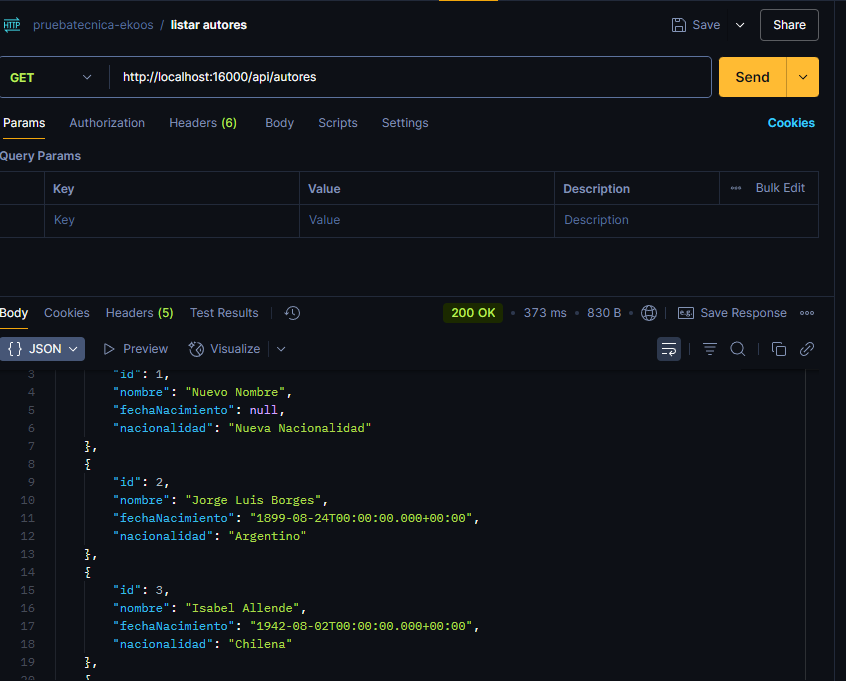
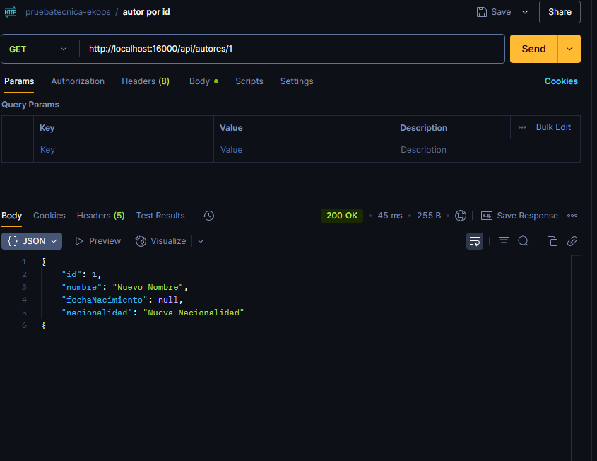
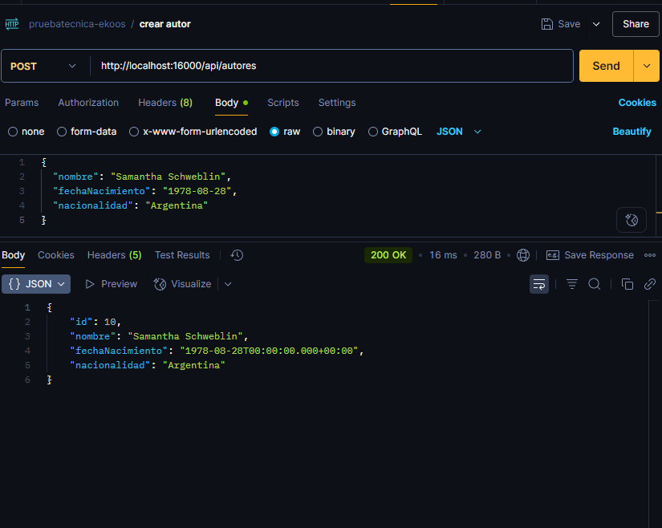
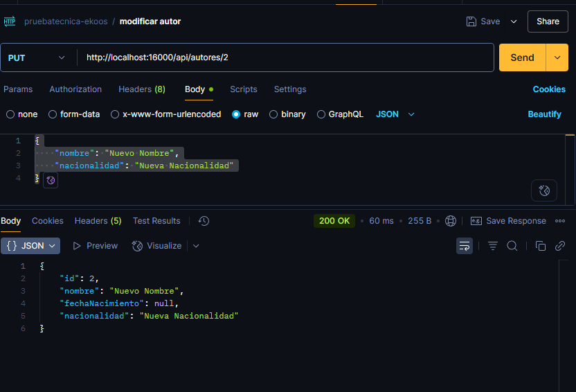
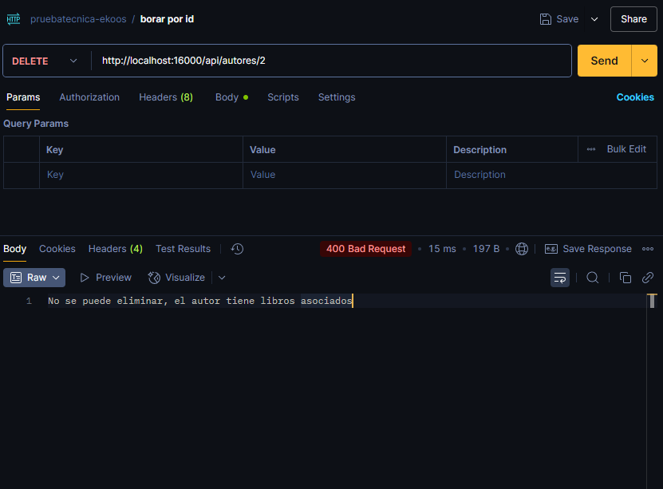
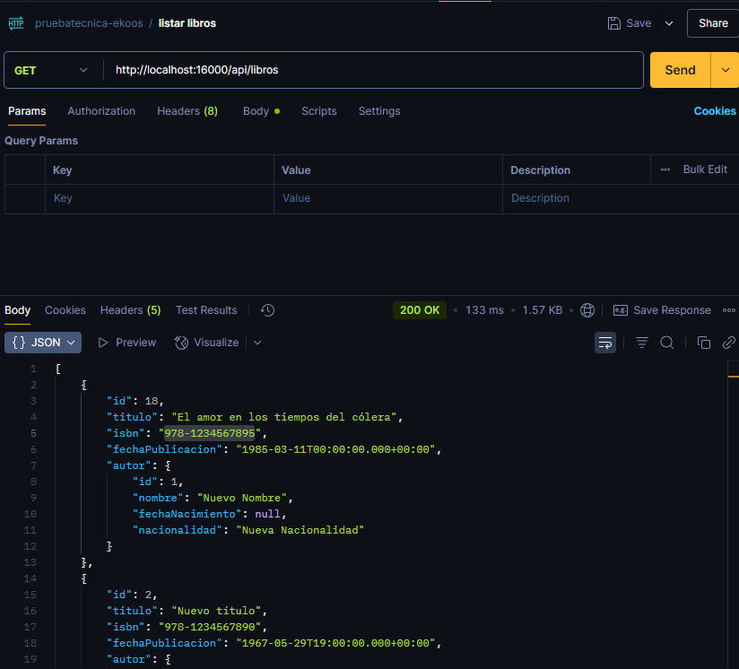
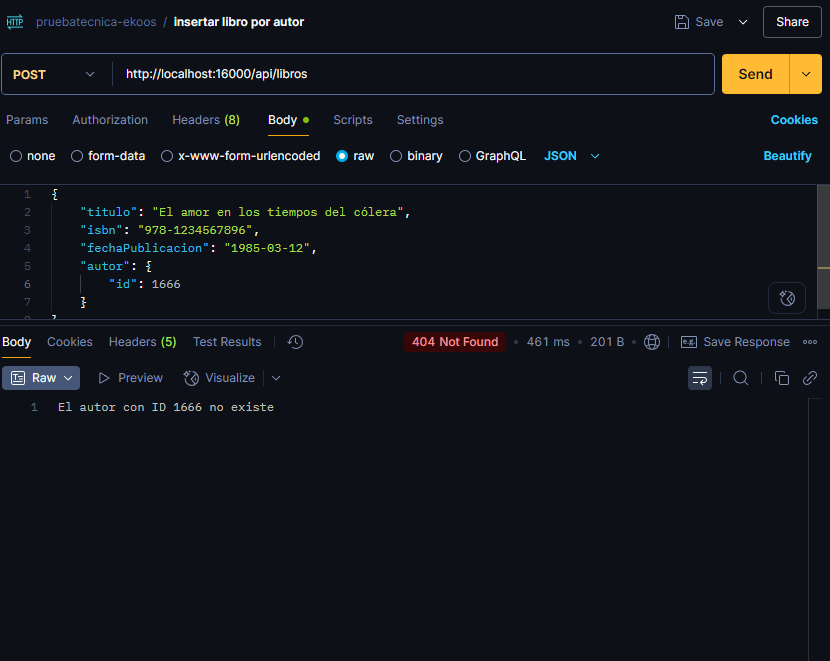
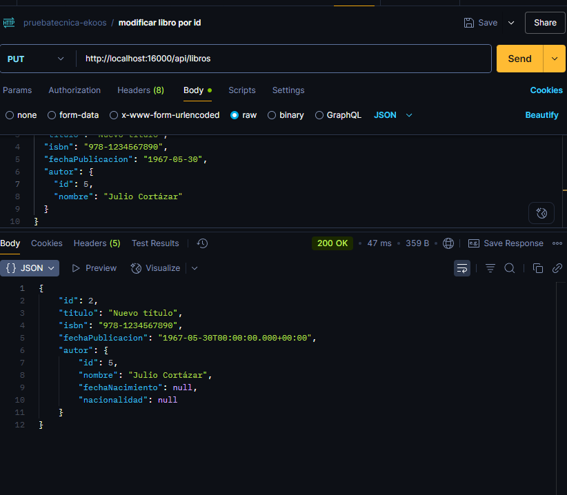
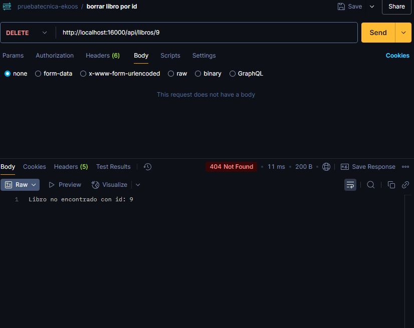

# 📬 Sistema de Gestión de Libros y Autores - Ekkos Solutions

- Autor: Erwin Soto
- Versión: 1.0.0

## 🧠 Descripción General
Solución backend completa para la administración de un catálogo bibliográfico, desarrollada como prueba técnica para Ekkos Solutions. El sistema ofrece:
- Gestión CRUD completa de libros y autores
- Validación de reglas de negocio
- API RESTful para integración con frontends o otros sistemas

## 🎯 Tecnologías Principales

| Componente     | Tecnología                    |
|----------------|-------------------------------|
| Backend        | PL/SQL ,Java 17 + Spring Boot 3.x     |
| Base de datos  | Oracle (contenedor Docker)    |
| Build tool     | Maven 3.5+                    |
| API            | REST JSON                     |
| Documentación  | OpenAPI/Swagger               |


## 📋 Requisitos Previos
- Docker (v20.10+) o Podman (v3.0+)
- Docker Compose (v1.29+) o Podman Compose
- JDK 17+  (OpenJDK)
- Maven 3.5+
- Git 2.20+

## 🚀 Instalación y Ejecución
1. Clonar el repositorio
   ```
   https://github.com/erwinsot/Tech_Tests_Ekko_Solutions.git
   cd Tech_Tests_Ekko_Solutions 
   ```
2. Iniciar la base de datos Oracle
   ```
   docker-compose up  o podman-compose up
   ```
   Esto creara un contenedor en el cual correra la base de datos

3. Construir la aplicación
   ```
   mvn clean package o ./mvnw clean package
   ```
4. Construir imagen de la api

   ```
   podman build  -t <nombre_imagen_deseado> .
   ```

    ```
   docker build  -t <nombre_imagen_deseado> .
   ```

5. Crear contenerdor de la api
   ```
   podman run --name <nombre_contenedor_deseado>
   -p <port:port> `
   -e "SERVER_PORT=<port>" `
   -e "SPRING_DATASOURCE_URL=jdbc:oracle:thin:@//host.containers.internal:1521/XEPDB1" `  
   <nombre_imagen>      
   ```
   - Esto creara el contenedor de la api
   - En caso de ejecutarlo con docker cabiar **host.containers.internal** por **host.docker.internal**
   ```
   podman run --name <nombre_contenedor_deseado>
   -p <port:port> `
   -e "SERVER_PORT=<port>" `
   -e "SPRING_DATASOURCE_URL=jdbc:oracle:thin:@//host.docker.internal:1521/XEPDB1" `  
   <nombre_imagen>       
   ```

   # Testeo de la Aplicación
- Puedes probar la API utilizando herramientas como:

🧪 cURL (desde la terminal)

💻 Postman (interfaz gráfica para testing de APIs)

🌙 Insomnia (alternativa liviana a Postman)
✅ Recomendación
Para desarrollo y pruebas rápidas:
Usa Postman o Insomnia si prefieres una interfaz amigable con historial de peticiones.
Usa cURL si prefieres trabajar desde la terminal o scripts automatizados.

- Para este proyecto se utilizó Postman. Si desea descargar la colección y probar los endpoints, puede hacerlo desde el siguiente enlace:

 ```link


 ```


## 📌 Ejemplos de Uso

A continuación, se muestran ejemplos de uso de la API utilizando Postman o herramientas similares como Insomnia o cURL.


### 📄 Listar Autores
Este ejemplo muestra cómo obtener la lista de todos los Autores registrados en base de datos.




### 📄 Obtener Autor por id
Este ejemplo muestra cómo obtener un autor por el id.




### ✅ Crear un Autor
Este ejemplo muestra cómo registrar un nuevo Autor.




### 📨 Modificar Autor
Este ejemplo muestra cómo enviar modificar un autor.




### 📨 Borrar Autor
Este ejemplo muestra cómo  borrar un autor.




### 📄 Listar Libros
Este ejemplo muestra cómo obtener la lista de todos los Libros registrados en base de datos.




### 📄 Obtener Libro por id
Este ejemplo muestra cómo obtener un Libro por el id.


### ✅ Crear un Libro
Este ejemplo muestra cómo registrar un nuevo Libro.




### 📨 Modificar Libro
Este ejemplo muestra cómo enviar modificar un Libro.




### 📨 Borrar Libro
Este ejemplo muestra cómo enviar borrar un Libro.



  


   

   


  


